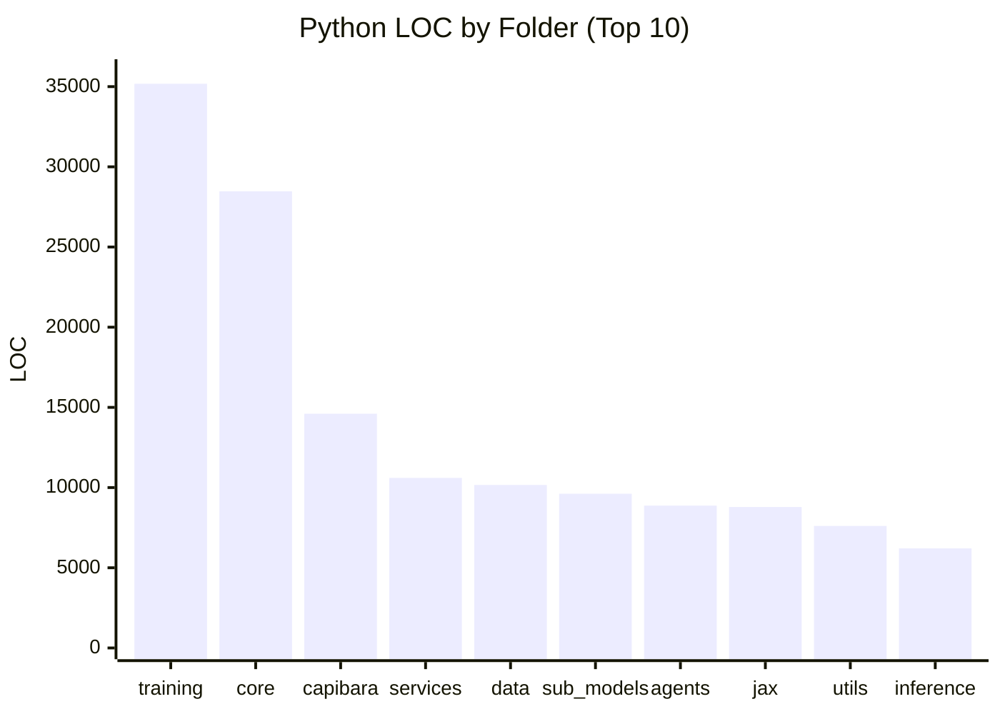

# CapibaraGPT v3

Experimental open-source foundation model stack for research and education.

## What this repository includes

- Multi-backend core runtime (CPU, optional GPU/TPU).
- Training modules (consensus, strategies, federated paths).
- Inference modules (including quantization/hybrid experiments).
- Data pipelines and dataset tooling.
- Optional services and integrations.
- Test and benchmark suites.

## Live Repository Metrics

Last refreshed: `2026-04-20`

### Snapshot

| Metric | Value |
|---|---:|
| Python files (repo only) | ~594 |
| Markdown files (repo only) | ~70 |
| Python LOC (repo only) | ~180,000 |
| Test files (repo only) | 38 |
| Test functions (`def test_*`, `async def test_*`) | ~466 |

### Python LOC by top-level folder (approximate)

| Folder | LOC |
|---|---:|
| `training` | 35,177 |
| `core` | 28,474 |
| `capibara` | 14,605 |
| `services` | 10,601 |
| `data` | 10,162 |
| `sub_models` | 9,616 |
| `agents` | 8,873 |
| `jax` | 8,788 |
| `utils` | 7,607 |
| `inference` | 6,208 |



## Current reality

This is an active research codebase, not a production-hardened product.
Some modules are fully functional, while others are still under active implementation.

Pending technical work lives in a single file:

- **[`BACKLOG.md`](./BACKLOG.md)** — concrete, verifiable pending items with scope and exit criteria.

The previous auto-generated `TODOs.md`, `TODOs_PRIORITIZED.md` and 20 per-folder `TODOs.md` files were removed on 2026-04-20 because they were low-signal regex scrapes that conflated code comments with real pending work.

## Requirements

- Python `>=3.9`
- `pip`

Optional acceleration backends:

- GPU: PyTorch + CUDA
- TPU: JAX + Flax

## Installation

```bash
git clone https://github.com/anachroni-co/capibaraGPT_v3.git
cd capibaraGPT_v3

python -m venv .venv
# Linux/macOS
source .venv/bin/activate
# Windows PowerShell
# .\.venv\Scripts\Activate.ps1

pip install -e .
```

Optional extras:

```bash
pip install -e ".[dev]"
pip install -e ".[gpu]"
pip install -e ".[tpu]"
```

## Quick start

```python
from core.backends import get_backend, BackendType

backend = get_backend(BackendType.AUTO)
print(f"Using backend: {backend.name}")
```

## Run tests

```bash
pytest tests/ -v
```

Coverage:

```bash
pytest tests/ --cov=core --cov-report=term-missing
```

## Run benchmarks

```bash
python -m benchmarks run
```

## Repository layout

- `core/`: model/runtime components.
  - `core/think_anywhere/` — Think-Anywhere reasoning module (see below).
  - `core/special_tokens/` — structured meta-token framework (see below).
- `training/`: training systems and strategies.
  - `training/data_capture/` — training data capture pipeline (see below).
- `inference/`: inference engines and quantization paths.
- `data/`: datasets, processing, and loading.
- `capibara/`: specialized modules (VQ, SSM, routers, optimizations).
- `services/`: optional service-level integrations.
- `sub_models/`: specialized expert modules.
- `tests/`: unit/integration/security/benchmark tests.
- `docs/`: project documentation.

## Think-Anywhere reasoning

`core/think_anywhere/` implements the **Think-Anywhere** mechanism from
[_Think Anywhere in Code Generation_](https://arxiv.org/abs/2603.29957)
(Jiang et al., Peking University / Alibaba, 2026).

Instead of reasoning only before the output (upfront thinking), Think-Anywhere
lets the model insert `<thinkanywhere>` blocks at any token position during
generation — focusing computation where the code is hardest to write.

### Key components

| Class | File | Purpose |
|---|---|---|
| `ThinkAnywhereConfig` | `config.py` | All hyperparameters: token strings, reward weights (α = 0.1 / 0.9), GRPO settings, semantic-mix α = 0.5 |
| `ThinkAnywhereProcessor` | `token_processor.py` | Format prompts (Table 1), parse responses, validate structure, strip thinking blocks, initialize special-token embeddings (Eqs. 5–6) |
| `ThinkAnywhereReward` | `rewards.py` | Hierarchical reward R = 0.1·R\_struct + 0.9·R\_correct (Eq. 9), subprocess sandbox execution, GRPO group-normalized advantages (Eq. 7) |
| `ThinkAnywhereStreamFilter` | `streaming.py` | Real-time streaming filter: suppresses thinking blocks token-by-token without buffering the full response |

### Quick usage

```python
from core.think_anywhere import ThinkAnywhereProcessor, ThinkAnywhereReward

proc = ThinkAnywhereProcessor()

# Format a prompt for Think-Anywhere generation
prompt = proc.format_prompt("Write a function that returns the edit distance between two strings.")

# Parse a model response — extract clean code and thinking blocks
result = proc.parse(model_response)
print(result.clean_code)           # executable code, all <thinkanywhere> stripped
print(result.think_anywhere_blocks)  # list of inline reasoning fragments
print(result.is_valid)             # structural validation (R_struct)

# Compute GRPO reward for a batch of rollout responses
reward_fn = ThinkAnywhereReward()
results = reward_fn.batch(responses, test_cases=["assert f('horse','ros') == 3"])
advantages = reward_fn.group_normalized_advantages(results)
```

### Inference integration

Set `InferenceConfig.think_anywhere_mode = True` to automatically strip
thinking blocks from generated text before returning it to the caller:

```python
from inference.hybrid_inference_engine import InferenceConfig, InferenceBackend

config = InferenceConfig(
    backend=InferenceBackend.AUTO,
    think_anywhere_mode=True,   # strips <think> and <thinkanywhere> blocks
)
```

Streaming (`generate_stream`) uses `ThinkAnywhereStreamFilter` to suppress
thinking content in real time — the caller never sees reasoning tokens.

### Special-token variant (Think-Anywhere\*)

`ThinkAnywhereConfig(use_special_tokens=True)` switches to single-token
`<ta>` / `</ta>` delimiters. Call
`ThinkAnywhereProcessor.initialize_special_token_embedding()` to compute
the semantic-aware embeddings from Eqs. 5–6 before fine-tuning:

```python
e_open, e_close = proc.initialize_special_token_embedding(
    tokenizer.get_input_embeddings().weight.detach().numpy(),
    token_ids={"think": t1, "any": t2, "where": t3, "<im_start>": t4, "<im_end>": t5},
)
```

## Special-token framework

`core/special_tokens/` generalizes the Think-Anywhere pattern into a reusable
framework for any structured meta-token type. Each token has semantic-aware
embedding initialization, a real-time streaming filter, and a global registry.

### Built-in tokens

| Token | strip? | Purpose |
|---|---|---|
| `<verify>` / `</verify>` | ✅ | Self-verification: model checks its output before continuing |
| `<plan>` / `</plan>` | ✅ | Task decomposition: outline algorithm before writing code |
| `<uncertain>` / `</uncertain>` | ❌ kept | Low-confidence marker: preserved for caller post-processing |
| `<search>query</search>` | ✅ | On-demand local RAG trigger at the exact token position needed |
| `<web_search>query</web_search>` | ✅ | Real-time internet search (Brave/Serper/DuckDuckGo) |
| `<fact_check>claim</fact_check>` | ❌ kept | Contradiction/misinformation signal: surfaces to UI for verification |
| `<lang:XX>` / `</lang>` | ✅ | Inline language switch (gl/pt/es/en/…) |
| `<debug>` / `</debug>` | ✅ | Error diagnosis before writing a fix |

### Quick usage

```python
from core.special_tokens import (
    get_registry, SearchTokenHandler, LangTokenProcessor,
    WebSearchHandler, WebSearchRetriever, FactCheckHandler,
)

reg = get_registry()
print(reg.list_tokens())
# ['verify', 'plan', 'uncertain', 'search', 'lang', 'debug', 'fact_check', 'web_search']

# Strip all strippable tokens (keeps <uncertain> and <fact_check>)
clean = reg.strip_all(model_output)

# <web_search> with live internet retrieval + RAG indexing
handler = WebSearchHandler(
    retriever=WebSearchRetriever(engine="brave", api_key="…"),
    rag_store=my_rag_store,      # optional: index results for future queries
    data_logger=my_capture,      # optional: log for training data
)
output = handler.process(model_output)  # <web_search>q</web_search> → [Web: …]

# <fact_check> claim extraction and verification
fc = FactCheckHandler(verifier=my_verifier)
processed, verdicts = fc.verify(model_output)
```

### Inference integration

`InferenceConfig.strip_special_tokens=True` (default) wires the registry into
the inference engine — all strip tokens are removed from `generate()` output.
`<uncertain>` and `<fact_check>` are intentionally preserved.

```python
from inference.hybrid_inference_engine import InferenceConfig, InferenceBackend

config = InferenceConfig(
    backend=InferenceBackend.AUTO,
    think_anywhere_mode=True,     # strips <think> / <thinkanywhere>
    strip_special_tokens=True,    # strips verify/plan/search/web_search/lang/debug
)
```

### Adding a custom token

```python
from core.special_tokens import SpecialTokenConfig, register_token

register_token(SpecialTokenConfig(
    name="cite",
    open_tag="<cite>",
    close_tag="</cite>",
    seed_tokens=["source", "reference", "citation"],
    strip_from_output=False,  # keep citations in output
))
```

### TOON context compression

`SearchTokenHandler` and `WebSearchHandler` serialize multi-result context
using **TOON (Token-Oriented Object Notation)** before injecting it into
the prompt — reducing input token overhead by ~30–40% for uniform arrays.

```
# Before (JSON-style, ~40 tokens):
[Retrieved: {"text": "Paris is the capital", "score": "0.9"}]
[Retrieved: {"text": "Population 2M", "score": "0.8"}]

# After (TOON, ~25 tokens):
[Retrieved:
results[2]{text,score}:
  Paris is the capital,0.9
  Population 2M,0.8]
```

**Impact:**
- ~30–40% fewer input tokens for RAG / web-search context injections
- Direct cost saving on external API calls (`ConfidenceRouter`) charged per input token
- Larger effective context window: more results fit in the same token budget → better quality

**Known limitation:** a 3B base model without TOON fine-tuning may misparse
dense tabular context. Disable with `use_toon=False` if accuracy degrades,
and track via `BACKLOG.md ISSUE-007`. Single-result queries always fall back
to plain text regardless of this setting.

```python
# Opt out if the model struggles with TOON context
handler = SearchTokenHandler(retriever=my_rag, use_toon=False)
handler = WebSearchHandler(retriever=my_web, use_toon=False)
```

## Training data capture

`training/data_capture/` intercepts high-signal inference interactions and
converts them into training pairs automatically — building a self-improving
dataset as the model is used.

### Signal sources

| Source | Trigger | Pair type | File |
|---|---|---|---|
| `web_search` | `<web_search>` fired | SFT — grounded response | `web_search.jsonl` |
| `fact_check` | `<fact_check>` verified | DPO — corrected vs original | `fact_check.jsonl` |
| `api_routing` | `<uncertain>`/`<fact_check>` → external API | DPO — teacher vs student | `api_routing.jsonl` |
| `uncertain` | `<uncertain>` spans present | SFT — queued for review | `uncertain.jsonl` |

### Pipeline

```
User query
    ↓
ConfidenceRouter.generate()
    ├── local model response
    │       ↓
    │   <uncertain> or <fact_check> detected?
    │       ├── YES → route to external API (OpenRouter / Llama / etc.)
    │       │           ├── return api_response to user
    │       │           └── log (prompt, local, api) → api_routing.jsonl  [DPO pair]
    │       └── NO  → return local response
    │                   └── log uncertain spans   → uncertain.jsonl
    │
    └── <web_search> in response?
            ↓
        WebSearchHandler.process()
            ├── fetch live results (Brave / Serper / DDG)
            ├── inject [Web: snippet] inline
            ├── index into local RAG store
            └── log (query, result)              → web_search.jsonl  [SFT pair]
```

### Quick usage

```python
from training.data_capture import TrainingDataCapture, CaptureConfig, ConfidenceRouter, RouterConfig
from core.special_tokens import WebSearchHandler, WebSearchRetriever

capture = TrainingDataCapture(CaptureConfig(output_dir="data/captured"))

# Wrap your inference function
router = ConfidenceRouter(
    local_fn=my_model.generate,
    config=RouterConfig(
        sample_rate=0.1,                                    # 10% random exploration
        api_model="meta-llama/llama-3.1-8b-instruct:free", # via OpenRouter
        api_key="sk-or-…",
    ),
    capture=capture,
)

# Wire web search with RAG indexing + data logging
web_handler = WebSearchHandler(
    retriever=WebSearchRetriever(engine="brave", api_key="…"),
    rag_store=my_rag,
    data_logger=capture,
)

# Use normally — data is captured automatically
response = router.generate(user_prompt)
response = web_handler.process(response)

# Stats
print(capture.get_stats())
# {'web_search': 42, 'api_routing': 18, 'uncertain': 7, 'fact_check': 3}
```

## CPU-only inference & training (no GPU/TPU)

All components below run on commodity CPU hardware — no CUDA, no JAX, no PyTorch required.

### Architecture: TransformerNumpyBackbone

Pure-NumPy GPT-2 style transformer used for local training and as a drop-in when GGUF files are not available.

| | Value |
|---|---|
| Architecture | 6 layers · 6 heads · d_model = 384 |
| Parameters | 10.9 M |
| Training corpus | 11 MB (repo `.py` + `.md`) |
| Baseline NTP loss | 6.30 nats/byte |
| After 2 000 steps | **3.08 nats/byte (−51 %)** |
| Throughput | ~1 350 tok/s on CPU |

### GGUF export & llama.cpp integration

Trained weights can be exported directly to GGUF (GPT-2 format) and loaded by llama.cpp without any network download:

```bash
python scripts/train_and_export_gguf.py \
    --steps 2000 --out models/capibara_trained.gguf
```

Place any real `.gguf` file in `models/` and `auto_backbone()` selects it automatically:

```python
from models.pretrained_backbone import auto_backbone
bb = auto_backbone()                    # picks GGUF > HF > NumPy
out = bb.generate("def factorial(n):", max_new_tokens=80)
```

Recommended drop-in models (download separately):

| Model | Size | Notes |
|---|---|---|
| `SmolLM2-135M-Instruct-Q4_K_M.gguf` | ~90 MB | best quality/size ratio |
| `Qwen2.5-0.5B-Instruct-Q4_K_M.gguf` | ~370 MB | stronger coding |
| `TinyLlama-1.1B-Chat-Q4_K_M.gguf` | ~670 MB | largest tested |

### Production CPU pipeline (5 steps)

```bash
python scripts/production_cpu_pipeline.py
```

| Step | Component | Result |
|---|---|---|
| 1 — KV Cache | `inference/cpu_kv_cache.py` | 1.21× decode speedup |
| 2 — INT8 | `inference/int8_inference.py` | ×4 memory reduction · 100 % greedy match |
| 3 — Gate loop | `inference/gate_inference_loop.py` | online ThinkAnywhereGate training |
| 4 — Server | `serving/cpu_server.py` | FastAPI + ThreadPoolExecutor + bounded queue |
| 5 — Eval | `evaluation/code_eval.py` | 8-task pass@k harness |

### L-MTP training (look-ahead multi-token prediction)

```bash
python scripts/train_lmtp_cpu.py --warmup-steps 300 --full-steps 300
```

Implements arXiv:2505.17505. After 600 steps on CPU:
- NTP loss: 5.55 → 4.11 (−26 %)
- L-MTP loss: 22.18 → 15.37 (−27 %)
- Look-backward inference: 7 tokens/step

## Corpus download & preparation

`scripts/download_corpus.py` streams pre-training data from HuggingFace without downloading entire datasets — all sources use Parquet format (no legacy scripts).

### Available sources

| Source | HF dataset | Languages | Notes |
|---|---|---|---|
| `wikipedia` | `wikimedia/wikipedia` | gl, es, pt, en, … | Clean encyclopedia text, ideal starting corpus |
| `culturax` | `uonlp/CulturaX` | gl, es, pt, en, … | Cleaned mC4 + OSCAR blend — best multilingual web source |
| `oscar` | `oscar-corpus/OSCAR-2301` | gl, es, pt, en, … | Deduplicated web crawl |
| `c4` | `allenai/c4` | en | High-quality filtered English web text |
| `books` | `storytelling-nlp/books_corpus` | en | Book-quality prose for language modelling |
| `code` | `HuggingFaceTB/smollm-corpus` | Python | Educational Python code (SmolLM training set) |

### Download

```bash
# Galician Wikipedia
python scripts/download_corpus.py --source wikipedia --lang gl \
    --output data/raw/gl/ --max-tokens 50_000_000

# Portuguese Wikipedia
python scripts/download_corpus.py --source wikipedia --lang pt \
    --output data/raw/pt/ --max-tokens 200_000_000

# English books
python scripts/download_corpus.py --source books --lang en \
    --output data/raw/books/ --max-tokens 200_000_000

# Python code
python scripts/download_corpus.py --source code --lang Python \
    --output data/raw/code/python/ --max-tokens 100_000_000

# List all sources
python scripts/download_corpus.py --list
```

### Tokenize to shards

```bash
python scripts/prepare_corpus.py \
    --input  data/raw/gl/ \
    --output data/tokenized/gl/
```

Produces `.npy` shards (int16, byte-level vocab=512) ready for `ShardDataLoader`.

### Reference corpus

Corpora validated on Google Axion c4a-standard-32:

| Corpus | Tokens | Shards | Quality |
|---|---|---|---|
| Galician Wikipedia | 51M | 1 | High |
| Spanish Wikipedia | 510M | 5 | High |
| Portuguese Wikipedia | 200M | 2 | High |
| C4 English | 200M | 2 | High |
| Python code (SmolLM) | 100M | 1 | High |
| **Total** | **~1.06B** | 11 | |

## Google Axion ARM64 training

`scripts/launch_axion_training.py` runs the Slim 200M model on Google Cloud
**c4a-standard-32** (32 vCPU, 128 GB RAM, Neoverse V2) using JAX CPU backend.
No GPU or TPU required.

### Model presets

| Preset | Params | d | L | H | seq | Axion tok/s | 5k steps |
|---|---|---|---|---|---|---|---|
| `smoke` | ~4M | 256 | 4 | 4 | 256 | ~25 000 | ~1 min |
| `small` | ~34M | 512 | 8 | 8 | 512 | ~3 400 | ~6 h |
| `medium` | ~114M | 768 | 12 | 12 | 1024 | ~800 | ~27 h |
| `full` | ~202M | 1024 | 12 | 16 | 2048 | ~200 | ~4 d |

Throughput measured on a live c4a-standard-32 VM — 8–12× better than initial estimates.

### Quick start

```bash
# Install (Axion / Neoverse V2)
pip install jax[cpu] flax optax psutil

# Smoke test — full training loop in ~1 min
python scripts/launch_axion_training.py \
    --data-dir data/tokenized/ \
    --preset smoke --steps 200

# Small model overnight
python scripts/launch_axion_training.py \
    --data-dir data/tokenized/ \
    --preset small --steps 5000 \
    --output checkpoints/axion/

# Custom config
python scripts/launch_axion_training.py \
    --data-dir data/tokenized/ \
    --hidden-size 512 --num-layers 8 --num-heads 8 \
    --seq-len 512 --batch-size 32 --steps 5000
```

### Thread configuration

The launcher automatically sets all CPU parallelism variables before JAX
initialises (`OMP_NUM_THREADS`, `XLA_FLAGS`, `MKL_NUM_THREADS`, etc.). On
a c4a-standard-32 the default `--threads 32` saturates all 32 vCPUs.

Config reference: `config/configs_toml/arm_axion/training.toml`

### TPU training

For TPU v5e/v6e, use `scripts/launch_tpu_training.py` with `--mesh-rows`
and `--mesh-cols` matching your topology (2×2 for v5e-4, 8×8 for v6e-64).

- Several advanced paths still include placeholder/mock logic (see `BACKLOG.md`).
- Hardware-specific features depend on external stacks and environment.
- Performance numbers can vary significantly across machines.

## Reproduce metrics

```bash
# Python/Markdown files (excluding venv)
rg --files -g "*.py" -g "!**/.venv/**" -g "!**/venv/**" -g "!**/.git/**" | wc -l
rg --files -g "*.md" -g "!**/.venv/**" -g "!**/venv/**" -g "!**/.git/**" | wc -l

# Test functions
rg -n "^(async )?def test_" -g "*.py" -g "!**/venv/**" -g "!**/.git/**" | wc -l
```

## License

Dual licensing (open + commercial). See `LICENSE`.

## Contact

- GitHub: `https://github.com/anachroni-co/capibaraGPT_v3`
- Website: `https://www.anachroni.co`
- Email: `info@anachroni.co`
