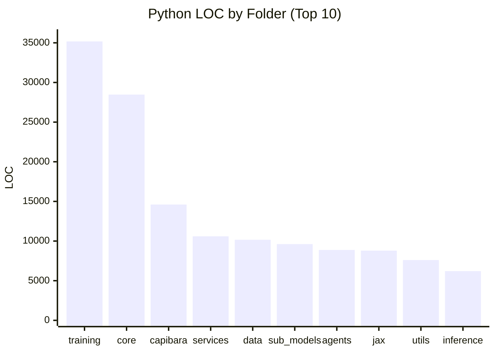

# CapibaraGPT v3

Experimental open-source foundation model stack for research and education.

## What this repository includes

- Multi-backend core runtime (CPU, optional GPU/TPU).
- Training modules (consensus, strategies, federated paths).
- Inference modules (including quantization/hybrid experiments).
- Data pipelines and dataset tooling.
- Optional services and integrations.
- Test and benchmark suites.

## Live Repository Metrics

Last refreshed: `2026-04-20`

### Snapshot

| Metric | Value |
|---|---:|
| Python files (repo only) | ~594 |
| Markdown files (repo only) | ~70 |
| Python LOC (repo only) | ~180,000 |
| Test files (repo only) | 38 |
| Test functions (`def test_*`, `async def test_*`) | ~466 |

### Python LOC by top-level folder (approximate)

| Folder | LOC |
|---|---:|
| `training` | 35,177 |
| `core` | 28,474 |
| `capibara` | 14,605 |
| `services` | 10,601 |
| `data` | 10,162 |
| `sub_models` | 9,616 |
| `agents` | 8,873 |
| `jax` | 8,788 |
| `utils` | 7,607 |
| `inference` | 6,208 |



## Current reality

This is an active research codebase, not a production-hardened product.
Some modules are fully functional, while others are still under active implementation.

Pending technical work lives in a single file:

- **[`BACKLOG.md`](./BACKLOG.md)** — concrete, verifiable pending items with scope and exit criteria.

The previous auto-generated `TODOs.md`, `TODOs_PRIORITIZED.md` and 20 per-folder `TODOs.md` files were removed on 2026-04-20 because they were low-signal regex scrapes that conflated code comments with real pending work.

## Requirements

- Python `>=3.9`
- `pip`

Optional acceleration backends:

- GPU: PyTorch + CUDA
- TPU: JAX + Flax

## Installation

```bash
git clone https://github.com/anachroni-co/capibaraGPT_v3.git
cd capibaraGPT_v3

python -m venv .venv
# Linux/macOS
source .venv/bin/activate
# Windows PowerShell
# .\.venv\Scripts\Activate.ps1

pip install -e .
```

Optional extras:

```bash
pip install -e ".[dev]"
pip install -e ".[gpu]"
pip install -e ".[tpu]"
```

## Quick start

```python
from core.backends import get_backend, BackendType

backend = get_backend(BackendType.AUTO)
print(f"Using backend: {backend.name}")
```

## Run tests

```bash
pytest tests/ -v
```

Coverage:

```bash
pytest tests/ --cov=core --cov-report=term-missing
```

## Run benchmarks

```bash
python -m benchmarks run
```

## Repository layout

- `core/`: model/runtime components.
  - `core/think_anywhere/` — Think-Anywhere reasoning module (see below).
- `training/`: training systems and strategies.
- `inference/`: inference engines and quantization paths.
- `data/`: datasets, processing, and loading.
- `capibara/`: specialized modules (VQ, SSM, routers, optimizations).
- `services/`: optional service-level integrations.
- `sub_models/`: specialized expert modules.
- `tests/`: unit/integration/security/benchmark tests.
- `docs/`: project documentation.

## Think-Anywhere reasoning

`core/think_anywhere/` implements the **Think-Anywhere** mechanism from
[_Think Anywhere in Code Generation_](https://arxiv.org/abs/2603.29957)
(Jiang et al., Peking University / Alibaba, 2026).

Instead of reasoning only before the output (upfront thinking), Think-Anywhere
lets the model insert `<thinkanywhere>` blocks at any token position during
generation — focusing computation where the code is hardest to write.

### Key components

| Class | File | Purpose |
|---|---|---|
| `ThinkAnywhereConfig` | `config.py` | All hyperparameters: token strings, reward weights (α = 0.1 / 0.9), GRPO settings, semantic-mix α = 0.5 |
| `ThinkAnywhereProcessor` | `token_processor.py` | Format prompts (Table 1), parse responses, validate structure, strip thinking blocks, initialize special-token embeddings (Eqs. 5–6) |
| `ThinkAnywhereReward` | `rewards.py` | Hierarchical reward R = 0.1·R\_struct + 0.9·R\_correct (Eq. 9), subprocess sandbox execution, GRPO group-normalized advantages (Eq. 7) |
| `ThinkAnywhereStreamFilter` | `streaming.py` | Real-time streaming filter: suppresses thinking blocks token-by-token without buffering the full response |

### Quick usage

```python
from core.think_anywhere import ThinkAnywhereProcessor, ThinkAnywhereReward

proc = ThinkAnywhereProcessor()

# Format a prompt for Think-Anywhere generation
prompt = proc.format_prompt("Write a function that returns the edit distance between two strings.")

# Parse a model response — extract clean code and thinking blocks
result = proc.parse(model_response)
print(result.clean_code)           # executable code, all <thinkanywhere> stripped
print(result.think_anywhere_blocks)  # list of inline reasoning fragments
print(result.is_valid)             # structural validation (R_struct)

# Compute GRPO reward for a batch of rollout responses
reward_fn = ThinkAnywhereReward()
results = reward_fn.batch(responses, test_cases=["assert f('horse','ros') == 3"])
advantages = reward_fn.group_normalized_advantages(results)
```

### Inference integration

Set `InferenceConfig.think_anywhere_mode = True` to automatically strip
thinking blocks from generated text before returning it to the caller:

```python
from inference.hybrid_inference_engine import InferenceConfig, InferenceBackend

config = InferenceConfig(
    backend=InferenceBackend.AUTO,
    think_anywhere_mode=True,   # strips <think> and <thinkanywhere> blocks
)
```

Streaming (`generate_stream`) uses `ThinkAnywhereStreamFilter` to suppress
thinking content in real time — the caller never sees reasoning tokens.

### Special-token variant (Think-Anywhere\*)

`ThinkAnywhereConfig(use_special_tokens=True)` switches to single-token
`<ta>` / `</ta>` delimiters. Call
`ThinkAnywhereProcessor.initialize_special_token_embedding()` to compute
the semantic-aware embeddings from Eqs. 5–6 before fine-tuning:

```python
e_open, e_close = proc.initialize_special_token_embedding(
    tokenizer.get_input_embeddings().weight.detach().numpy(),
    token_ids={"think": t1, "any": t2, "where": t3, "<im_start>": t4, "<im_end>": t5},
)
```

## Limitations

- Several advanced paths still include placeholder/mock logic (see `BACKLOG.md`).
- Hardware-specific features depend on external stacks and environment.
- Performance numbers can vary significantly across machines.

## Reproduce metrics

```bash
# Python/Markdown files (excluding venv)
rg --files -g "*.py" -g "!**/.venv/**" -g "!**/venv/**" -g "!**/.git/**" | wc -l
rg --files -g "*.md" -g "!**/.venv/**" -g "!**/venv/**" -g "!**/.git/**" | wc -l

# Test functions
rg -n "^(async )?def test_" -g "*.py" -g "!**/venv/**" -g "!**/.git/**" | wc -l
```

## License

Dual licensing (open + commercial). See `LICENSE`.

## Contact

- GitHub: `https://github.com/anachroni-co/capibaraGPT_v3`
- Website: `https://www.anachroni.co`
- Email: `info@anachroni.co`
